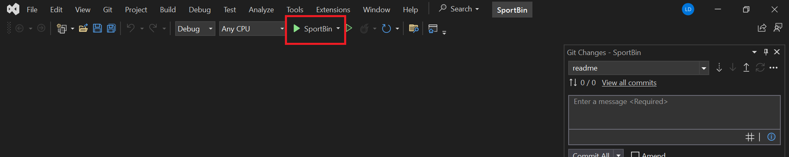

This app is created for my personal campaign to promote my work style to my local area.

### Visit in the browser

To visit the application in the browser, go to [https://photo.tomislavkovacevic.com/](https://photo.tomislavkovacevic.com/)

### Start locally

To start the application locally, follow these instructions:

1. Download and install node.js from [https://nodejs.org/en](https://nodejs.org/en)
2. Clone the project
3. In the terminal, navigate to ..\SportBin\ClientApp
4. In the terminal, type the following command
   ```sh
   npm i
   ```
5. Open the Photography.snl file
6. In Visual Studio, click on the green start button labeled 'SportBin'
   
   
## Meta

This application was developed as a part of a university course assignment.
